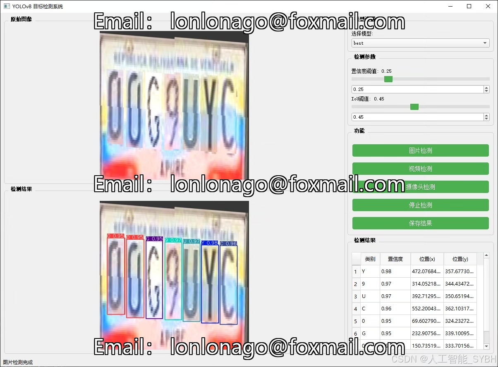
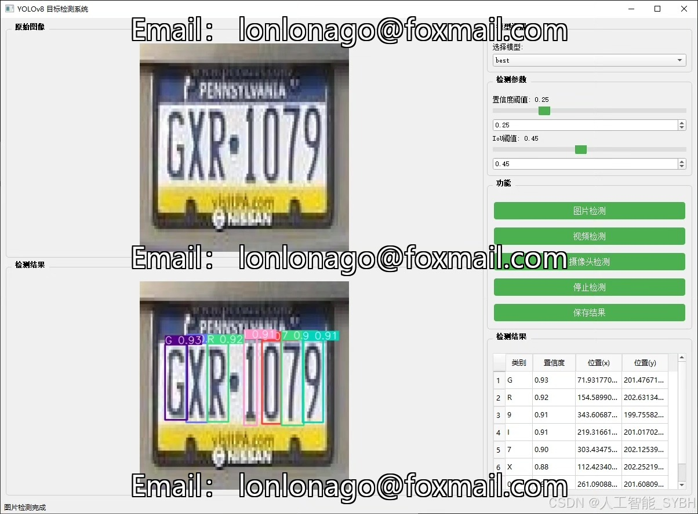
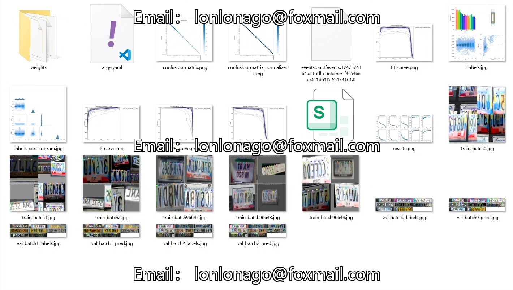
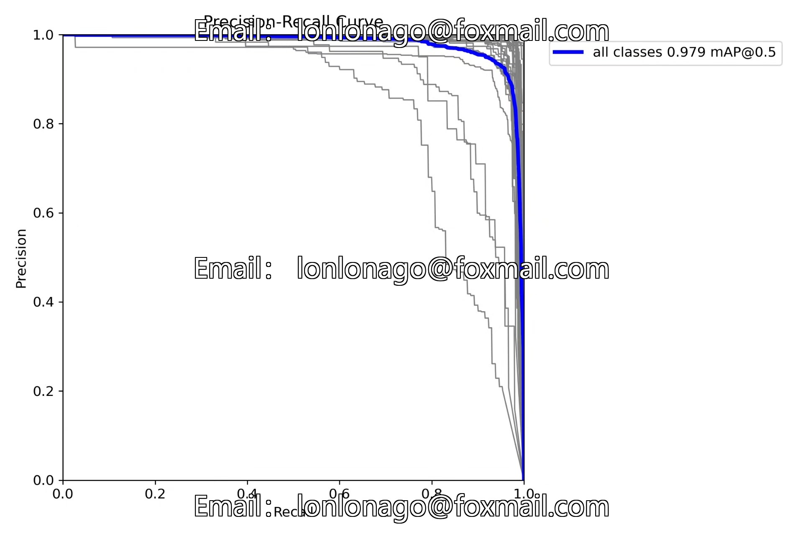
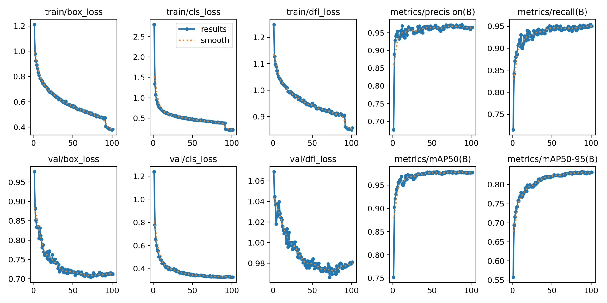
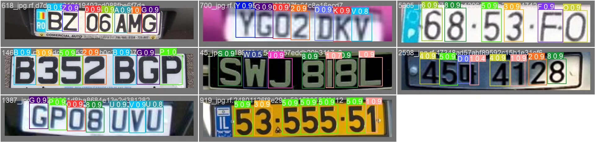
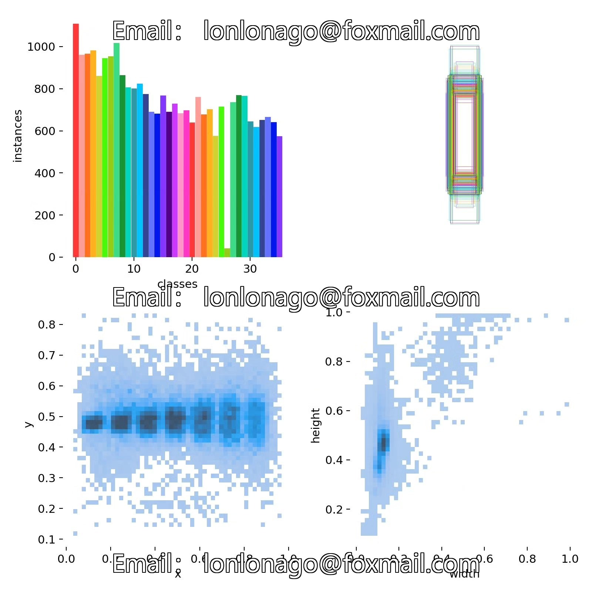
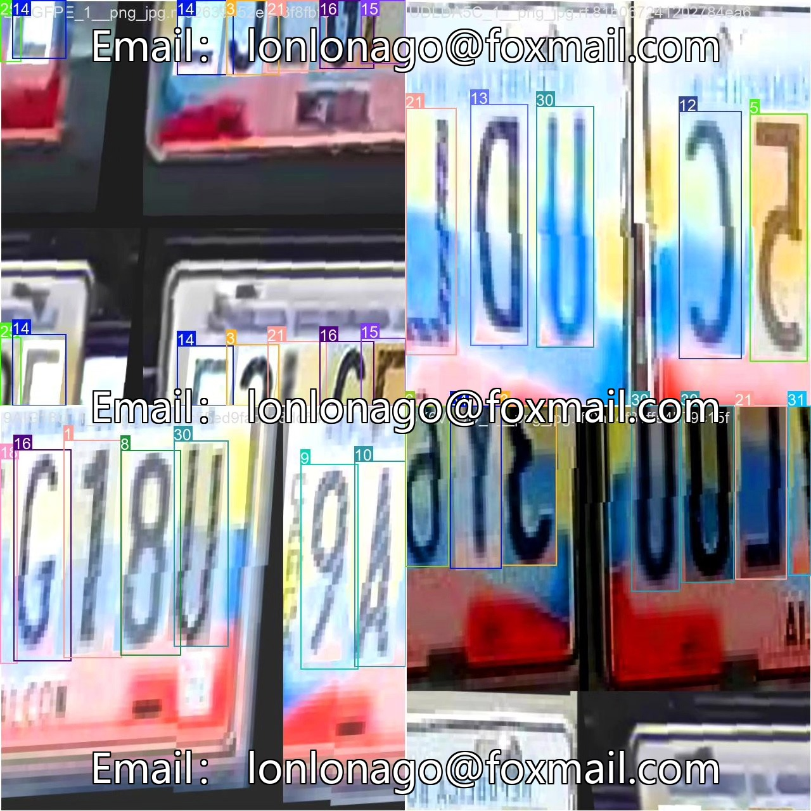

# Based on deep learning YOLOv8, the letter and number recognition detection system (YOLOv8)

## Body

Based on the advanced YOLOv8 deep learning framework, this project has developed a high-precision and efficient letter and number recognition detection system. It can simultaneously recognize and classify 36 types of characters (digits 0-9 and letters A-Z). The system was trained and optimized on a dedicated dataset containing 4,245 training images, 1,221 validation images, and 610 test images, achieving real-time multi-character detection and recognition in complex scenarios.

The company's products have obtained the official commercial license certification from YOLO.

We provide after-sales service.

After payment, we will provide WeChat ID for any questions.

Environment configuration: We will provide an environment configuration tutorial, and WeChat will provide Q&A.

Remote installation service: If you need remote configuration, an additional fee of 69 is required.
If the configuration fails, all fees will be refunded (specially for old computers only refund installation fees).

Retraining dataset: After setting up the environment, you can train on your own computer.
If you need us to retrain, just pay 69 + computing power fees (2.5 yuan/hour).

Full after-sales service

## Images

## Payment

Here is a pay link on Stripe ( https://buy.stripe.com/3cs8yP7sY87d0vu9AB ). Please contact me lonlonago@foxmail.com after funding $89, and I will send you a complete data files , thank you!

